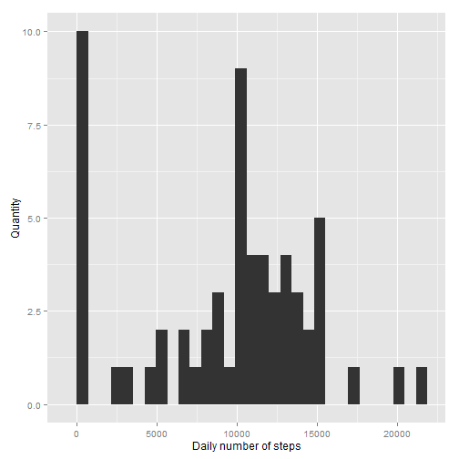

This is an R Markdown document. Markdown is a simple formatting syntax for authoring HTML, PDF, and MS Word documents. For more details on using R Markdown see <http://rmarkdown.rstudio.com>.

When you click the **Knit** button a document will be generated that includes both content as well as the output of any embedded R code chunks within the document. You can embed an R code chunk like this:

import libraries and change echo option

```r
#summary(cars)
library(plyr)
library(ggplot2)
echo = TRUE
```

###read the data

```r
data <- read.csv("activity.csv")
data$date <- as.POSIXct(data$date)
```
###aggregation steps, making first plot and computting the mean and median

```r
sum_steps <- aggregate(data$steps, by=list(data$date), sum, na.rm = TRUE)
names(sum_steps) <- list("Day", "Steps_amount")

#1 Mean total number of steps taken per day
qplot(sum_steps$Steps_amount, geom ="histogram", xlab="Daily number of steps", ylab="Quantity")
```

 

```r
mean_steps <- mean(sum_steps$Steps_amount)
median_steps <- median(sum_steps$Steps_amount)
```

###Average daily activity pattern

```r
int_steps <- aggregate(data$steps, by= list(data$interval), mean, na.rm=TRUE)
int_steps_med <- aggregate(data$steps, by= list(data$interval), median, na.rm=TRUE)
int_steps_all <- cbind(int_steps[], int_steps_med$x)
names(int_steps_all) = c("interval", "mean_steps", "median_steps")
int_steps_all$mean_steps <- round(int_steps_all$mean_steps)
int_steps_all$median_steps <- round(int_steps_all$median_steps)
ggplot(int_steps_all, aes(x = interval, y = mean_steps)) + geom_line()
```

 

```r
max_steps <- int_steps_all$interval[int_steps_all$mean_steps == max(int_steps_all$mean_steps)]
```
### NA's impute mean

```r
#find NA
na_steps <- subset(data, is.na(steps))
number_of_NA <- length(na_steps$steps)

#replace NA with median
n_steps <- data.frame(date=data$date[is.na(data$steps)], interval = data$interval[is.na(data$steps)], steps = int_steps_all[match(int_steps_all$interval, data$interval[is.na(data$steps)]),3])

#remove te NA's from the period
data <- subset(data, !is.na(steps))

#append the median steps to te activity df
data <- rbind(data, n_steps)
```

###sum the number of steps eac day and get the mean and median, plot new hist

```r
#new sum without NA
int_steps_med2 <- aggregate(data$steps, by = list(data$date), sum, na.rm = TRUE)
names(int_steps_med2) <- c("Date", "steps")
#histogram without missing
qplot(int_steps_med2$steps, geom ="histogram", xlab="Daily number of steps, median instead of NA", ylab="Quantity")
```

 

```r
#mean median
mean_steps2 <- mean(int_steps_med2$steps)
median_steps2 <- mean(int_steps_med2$steps)
```

### create new var weekday/end, preprocess for plotting

```r
data$week_d_e <- ifelse(weekdays(data$date)=="Saturday" | weekdays(data$date)=="Sunday", "weekend", "weekday") 


int_steps_mean3 <- aggregate(data$steps, by = list(data$week_d_e, data$interval), mean, na.rm = TRUE)
int_steps_median3 <- aggregate(data$steps, by = list(data$week_d_e, data$interval), median, na.rm = TRUE)

int_steps3 <- cbind(int_steps_mean3[], int_steps_median3$x)

names(int_steps3) <- c("weekday", "interval", "mean_steps", "median_steps")
int_steps3$mean_steps <- round(int_steps3$mean_steps)
int_steps3$median_steps <- round(int_steps3$median_steps)
```

### Plot graphs weekday/end

```r
#plot two lines to compare
par(mfrow=c(1,1))
with(int_steps3, plot(mean_steps ~ interval, type="n", main="Weekday and Weekend"))
with(int_steps3[int_steps3$weekday == "weekday",], lines(mean_steps ~ interval, type="l", col="chocolate"))
with(int_steps3[int_steps3$weekday == "weekend",], lines(mean_steps ~ interval, type="l", col="16"))
legend("topright", lty=c(1,1), col = c("chocolate", "16"), legend = c("weekday", "weekend"), seg.len = 3)
```

 
### Thank You for attention! :)
